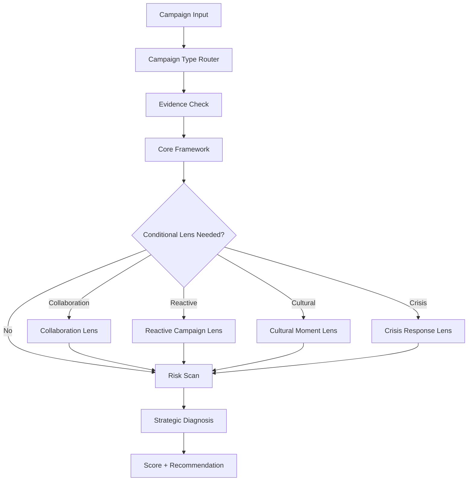

# Marketing Campaign Critic

> An evaluation-driven Agent Skill for critical marketing campaign analysis, IMC diagnosis, and strategic risk assessment.

**Current version: v0.4.1**

Marketing Campaign Critic was built from a blank `SKILL.md` and iterated through real campaign tests. The goal is not to summarize campaigns or reward virality. It is to diagnose **why a campaign works, where the strategy breaks, whether the channels truly integrate, and what risks could override an otherwise strong idea**.

## Why this matters

Campaign analysis often collapses into two bad habits:

1. **Popularity = quality**
2. **Personal taste = critique**

This skill separates:

- evidence from inference,
- creative quality from strategic quality,
- reach from business impact,
- multi-channel activity from actual IMC integration,
- strong ideas from material execution risk.

The result is a more explainable and repeatable framework for campaign diagnosis.

## Architecture



The design principle is simple:

> **Routing first, reasoning second.**

Different campaign types should not be forced into one linear planning model.

## Core framework

Every campaign is evaluated across six dimensions:

| Dimension | Weight | What it tests |
|---|---:|---|
| Audience | 15 | Is the audience strategically meaningful, not just demographic? |
| Insight | 20 | Is there a real human, cultural, behavioral, or category insight? |
| Strategy | 20 | Does the campaign make a coherent strategic choice? |
| Big Idea | 20 | Is the idea distinctive, extensible, and connected to the brand? |
| IMC Integration | 15 | Do channels have connected roles across the journey? |
| Measurement | 10 | Do objective, KPI, and measurement actually align? |
| **Total** | **100** | |

## Conditional lenses

Extra modules load only when relevant:

- **Collaboration Lens** → audience overlap, complementarity, occasion fit, equity transfer, role balance
- **Reactive Campaign Lens** → reaction speed, cultural interpretation, restraint, amplification
- **Cultural Moment Lens** → cultural relevance, participation, timing, authenticity
- **Crisis Response Lens** → acknowledgment, accountability, corrective action, stakeholder relevance

This prevents the skill from becoming a giant checklist that treats every campaign the same way.

## Risk layer

After the strategic analysis, the skill scans for material risk across:

- Legal / compliance
- Brand safety
- Execution
- Ethics

Risks are classified as **Low / Medium / High**.

A material **High** risk can trigger a **Risk Override**, meaning a campaign may score well strategically but still receive a “do not launch in current form” judgment.

The skill is also instructed **not to invent risks merely because a risk section exists**.

## Demo

### Example prompt

> Analyze adidas “进城办事”. I want a strategic critique, not a campaign summary.

### Abridged output

```text
Primary Type: Reactive Campaign
Secondary Type: Cultural Moment
Insight Type: Cultural + Behavioral
Confidence: High

Strategic Score: 84 / 100
Brand Ownership: Execution-built
Highest Risk: Brand Safety — Medium
Risk Override: No

Diagnosis:
The campaign's strength comes from cultural sensitivity,
response speed, and restraint rather than from manufacturing
its original idea.
```

See the fuller example in [`docs/demo.md`](docs/demo.md).

## Evaluation-driven development

The skill did not start with the current architecture. Each version came from a failed assumption exposed by testing.

| Version | Test | What broke | What changed |
|---|---|---|---|
| v0.1 | adidas “进城办事” | 60-point math, linear planning assumption, static brand ownership | weighted 100-point scoring, campaign routing, ownership levels |
| v0.2 | Luckin Coffee × Duolingo | “insight = human tension” was too narrow, collaboration logic missing | insight taxonomy, Collaboration Lens |
| v0.3 | Pechoin “1931” | viral creative could still hide weak journey integration and execution risk | Risk Scan, Risk Override |
| v0.4.1 | adidas regression rerun | risk modules can tempt an agent to manufacture problems | explicit safeguard against invented risk |

This is the core development loop:

```text
Minimal Skill
   ↓
Real Campaign Test
   ↓
Failure / Blind Spot
   ↓
Rule or Module Change
   ↓
Regression Test
```

## What I designed

This project demonstrates more than prompt writing. The work includes:

- task scoping and behavioral rules,
- campaign-type routing,
- evidence / inference separation,
- explainable weighted scoring,
- conditional reasoning modules,
- brand-ownership logic,
- strategic risk overrides,
- behavioral regression tests,
- versioned iteration through `CHANGELOG.md`.

## Repository structure

```text
marketing-campaign-critic/
├── SKILL.md
├── README.md
├── CHANGELOG.md
├── VERSION
├── references/
│   └── architecture.md
├── docs/
│   └── demo.md
└── evals/
    ├── README.md
    ├── 001_adidas_errands.md
    ├── 002_luckin_duolingo.md
    └── 003_pechoin_1931.md
```

## Evals

The files in `evals/` are behavioral regression tests, not campaign summaries.

Each test records:

- what the agent should recognize,
- what it must not overclaim,
- what kind of output would indicate a regression.

Small score movement is acceptable. The **direction of diagnosis** should remain stable.

## Status

**Pre-1.0.**

The current goal is stability, not feature accumulation. New modules should only be added when a real evaluation reveals a repeated blind spot or users repeatedly need a distinct analytical behavior.

## Portfolio positioning

This project can be presented as:

> **AI Agent Skill / Marketing Strategy Tool**  
> Designed an evaluation-driven campaign analysis system that routes different campaign types through a shared strategic framework, loads conditional reasoning modules, separates evidence from inference, and applies risk overrides without conflating virality with effectiveness.
